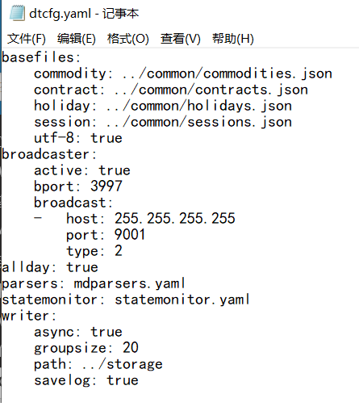
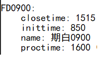
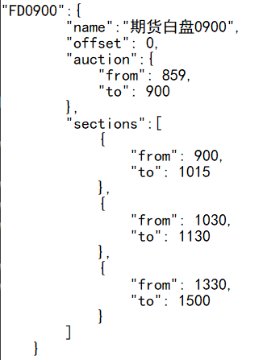
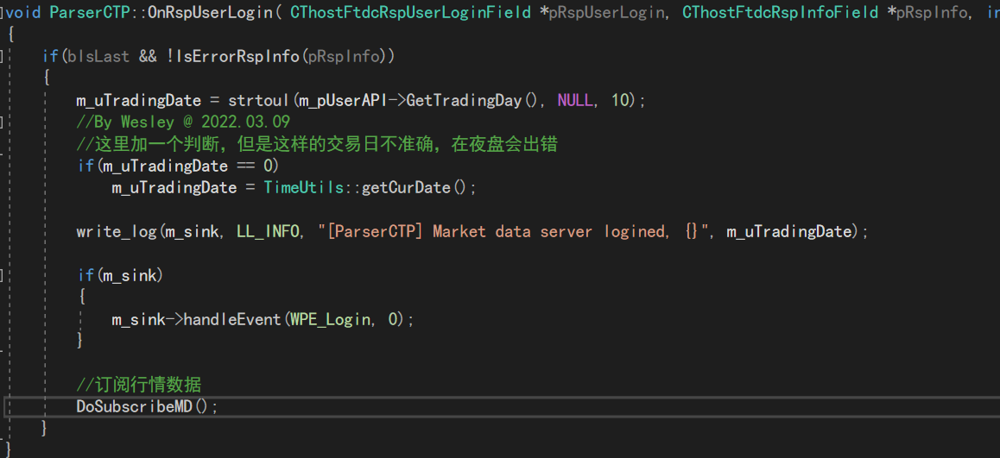
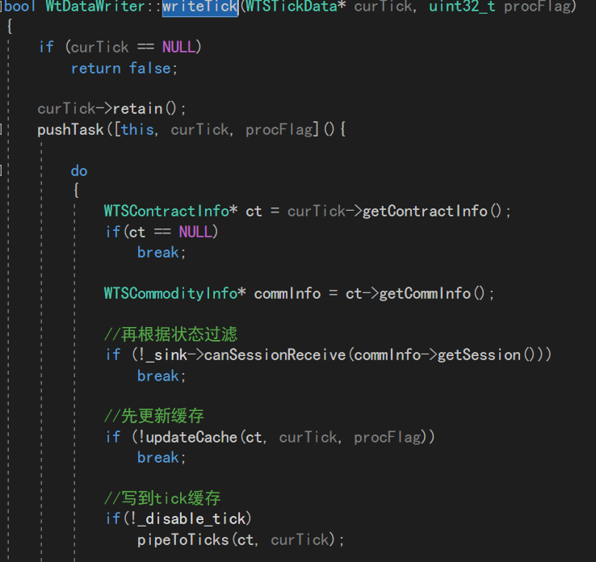

### wt中数据通过QuoteFactory来落地，它是一个在DataKit目录中的C++可执行程序。

&emsp;&emsp;首先介绍一下在QuoteFactory中的主要配置文件有四种可用的名称
分别是QFConfig,dtcfg和yaml，json的组合，我们任取一种作为主配置文件名即可。
用一个简单的dtcfg.yaml来稍微介绍一下主配置中会有什么数据
首先是basefiles，它的值的集合构成了基本配置文件的路径，基本配置文件会有
品种，合约，假期，交易时段等。
接下来是broadcaster，它决定了数据广播是否启动，发送的端口，以及接受方的IP地址以及端口
在此例中IP地址设为了255.255.255.255，这是一个广播地址。
allday属性，如果打开，程序就会被状态机监管，在状态机设了很多限制, 对节日或收盘时间检查非常严格，
不在交易时段的数据是无法被接收的。同时状态机还能指导收盘作业的开始。
之后是parsers，它里面包含了行情解析的相关配置或者配置文件名
statemonitor，它里面包含了状态机的相关配置或者配置文件名
在writer中，规定了数据存入的属性，async关于是否异步执行，groupsize决定了每次存多少条tick数据
path关乎了文件存储目录。   

  

   
&emsp;&emsp;简单介绍主要配置后，我们进入QuoteFactory的主逻辑函数initialize中。
首先，它会加载主配置，并且用存储主配置的config(**WTSVariant**)来加载市场信息，也就是
初始化g_baseDataMgr(**WTSBaseDataMgr**)的部分成员变量，另外，还要g_hotMgr（**WTSHotMgr**）
的部分成员变量，它关乎合约主力相关信息。
在这一系列初始化完毕后，来到
``g_udpCaster.init(config->get("broadcaster"), &g_baseDataMgr, &g_dataMgr);``
UDPCaster的init函数比较简洁
也就是通过上述提及到的dtcfg.yaml中broadcaster的各种属性来为成员变量赋值。
接下来，比较关键，如果我们的主配置文件**allday**为true，那么在此不会启动状态机，
如果为false或者没有allday属性，那么就会执行
``g_stateMon.initialize(config->getCString("statemonitor"), &g_baseDataMgr, &g_dataMgr);``
初始化状态机。我们简单看一下这个函数。
首先，设置好_bd_mgr（**WTSBaseDataMgr**）和_dt_mgr（**DataManager**）
并且从_bd_mgr中获取一个交易时段信息类
``WTSSessionInfo* ssInfo = _bd_mgr->getSession(sid.c_str());``
获取ssinfo
之后依次加载statemonitor配置文件中的所有成员，
他们的格式是类似于这样的   

  

对每个成员遍历一遍，同时执行``StatePtr sInfo(new StateInfo);``创建出一个sInfo。
注意，在QuoteFactory前面我们初始化g_baseDataMgr中的session中用的sessions文件，它的格式类似于   

  

这两个不同配置中的成员是通过"FD0900"这样的ID联系起来的，我们在设置sInfo的属性后，将同一个sid放入，这里就
是"FD0900"。   

&emsp;&emsp;之后依次获取偏移后的集合竞价时段和交易时段，放入sInfo的_sections中。
然后把这个sinfo放入到_map(StateMap)中。这之后，判断所有的合约是否在交易日中。
于是状态机的initialize就结束了，我们回到QuoteFactory的initialize中。
初始化完状态机（在allday模式不初始化）后，会调用initDataMgr函数初始化g_dataMgr（**DataManager**）
同样是调用了g_dataMgr的的init函数，需要注意的是，如果是全天模式，则不传递状态机给DataManager。
这个函数不多加以讲解，需要注意的是g_dataMgr是一个DataManager，DataManager又派生自IDataWriterSink
暗示了其是一个数据写入的管理类，g_dataMgr会在init函数中初始化一个_writer，即IDataWriter。
回到QuoteFactory，接下来如果存在指数模块要，配置指数，随之来带最重要的部分：初始化parser。
我们使用parsers中的配置依次(可能有多个parser)调用initParsers来初始化parser。
关注这个函数，new出一个ParserAdapter后，使用其init函数进行初始化，之后，把它添加到g_parsers（**ParserAdapterMgr**）
中。函数结束回到QuoteFactory，执行config的release后，将g_parsers的run函数加入到g_asyncIO（boost::asio::io_service）中等待执行。
同样的，在main函数中执行完initialize函数，我们就会调用``g_asyncIO.run();``来执行添加的任务，也就是
g_parsers的run函数。   
   
&emsp;&emsp;事不宜迟，我们即刻定位到g_parsers的run函数，来看看在QuoteFactory的故事之后，还有什么事情在发生。
g_parsers是一个ParserAdapterMgr类，这个类负责对ParserAdapter进行统筹管理，它的run函数很简单，就是从_adapters（ParserAdapterMap）
中一个个找出ParserAdapter并且调用他们的run函数。
追踪到ParserAdapter的run函数，我们可以轻易地发现，它执行了_parser_api的connect函数。没错，_parser_api是一个IParserApi类
这个类就负责了WT与不同行情柜台的对接。   
   
&emsp;&emsp;我们接下来以最为常用的CTP柜台以及负责对接CTP行情柜台的ParserCTP为例来讲解。
故事从ParserCTP的connect函数说起，在这里调用了m_pUserAPI（**CThostFtdcMdApi**）的Init函数。
在这个函数被调用后，当柜台API与交易托管系统成功建立起通信连接时，ParserCTP的OnFrontConnected被回调，
在这里面，我们调用ReqUserLogin函数来登录柜台，登录成功后，ParserCTP的OnRspUserLogin会被回调，
在这里面，设置了交易日，让m_sink（**IParserSpi 也就是之前的ParserAdapter**）处理登录事件（这个好像并没有实现）。
最后，调用DoSubscribeMD函数来订阅行情数据。   

  

   

DoSubscribeMD函数中，我们对所有m_filterSubs（**CodeSet**）存储的合约代码进行订阅。
订阅成功后，主要通过ParserCTP的OnRtnDepthMarketData函数推送行情信息。
OnRtnDepthMarketData函数会比较长，但是其目的非常简单，过滤掉有问题的行情，将返回的CTP行情格式
转换为WT内置的行情格式，最后，将这个tick转入m_sink的handleQuote使WT对这笔tick进行处理。
在ParserAdapter的handleQuote函数中，前面做过一些判断后，执行到
``_dt_mgr->writeTick(quote, procFlag)``
这里。
进入到这个函数，观察到_dt_mgr使用了成员变量_writer（**IDataWriter**）的writeTick函数。
进入到这个函数，在经过一系列判断后

  

    
会调用pipeToKlines(ct, curTick);写K线缓存
这部分比较多且复杂，我们暂且不提，先看到后面的``_sink->broadcastTick(curTick);``_sink是一个IDataWriterSink类
易知，它就是我们前面说的DataManager，我们看到DataManager的broadcastTick，
函数很简洁，判断之后调用了_udp_caster（**UDPCaster**）的broadcast函数。也就是说，我们成功把parser获取的tick数据存储
并且通过UDP广播出去了。   

&emsp;&emsp;ok，至此我们已经基本过了一遍数据落地的初始化，执行，一笔tick的走向，至于接下来这笔tick是如何在步进器，CTA引擎，
策略中流动，尚待下文。
